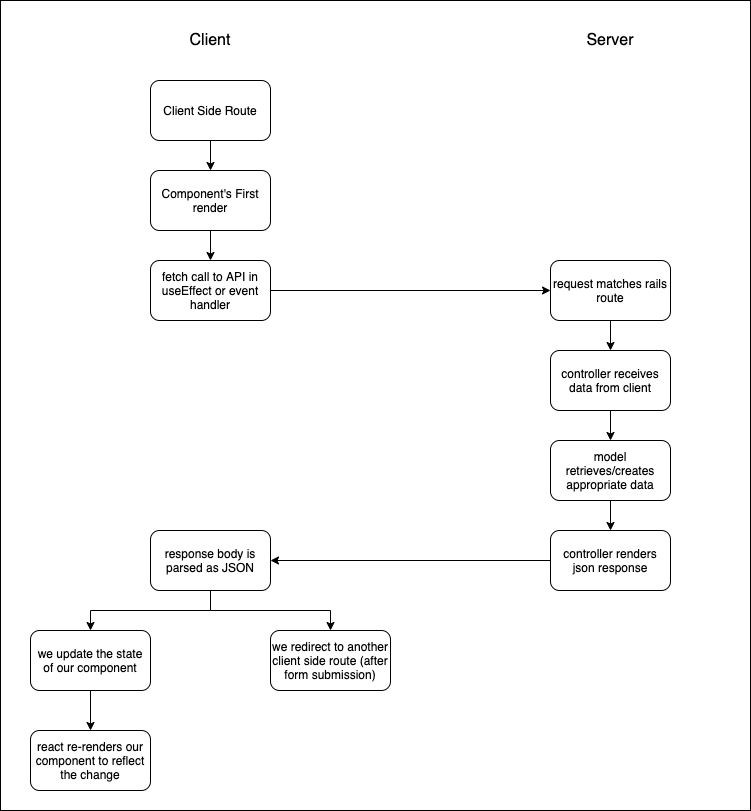

# Client-Server Communication Part 2



When we work on tasks related to client-server communication, following along with a diagram and having a clear picture in your mind of what's supposed to happen at each stage up front is key to avoiding frustration. There are lots of places to make mistakes or forget things, so you can ask yourself these questions to make sure you put your eyes in the right places to spot errors/omissions:

```
## <Insert Feature Description Here>

### What's my client side route?

### Which component does it render?

### Where should the useEffect/event handler send a request to (and which type of request)?

### What controller#action does the server side route point to?

### What data is retrieved from/created in the model layer?

### What should the server JSON response look like?

### After we parse response as JSON on the client side, what's the next step? State update or client side redirect? 

### If state update, which piece of state? If redirect, which client side route?

```
## Task 1 - Adding a Buy button

Let's review how to handle POST requests to create by adding a buy option to our items. In our case, buying an item will create an order.

- Add a Buy Button to the Item Card (that creates an order for that item)
- Add an Order show route (client side) that displays the `OrderCard` component
  - fetches order data from the API
  - Displays order

## Task 2 - Adding an edit Item feature

- Add an Item edit route (client side) that
  - fetches item data from the API
  - loads it into the controlled form
  - handles submission by updating the Item on the backend
  - redirects to the items index route (client side) where we should see the updated item info


## Task 3 In breakouts - Adding a Delete Button to Item Card

- Add a Delete Item button to the Item Card 
- When clicked the button should send a request to the API to delete the Item
- when we get a successful response we should remove the Item from the items index view
- should allow us to delete items even if they have associated orders.